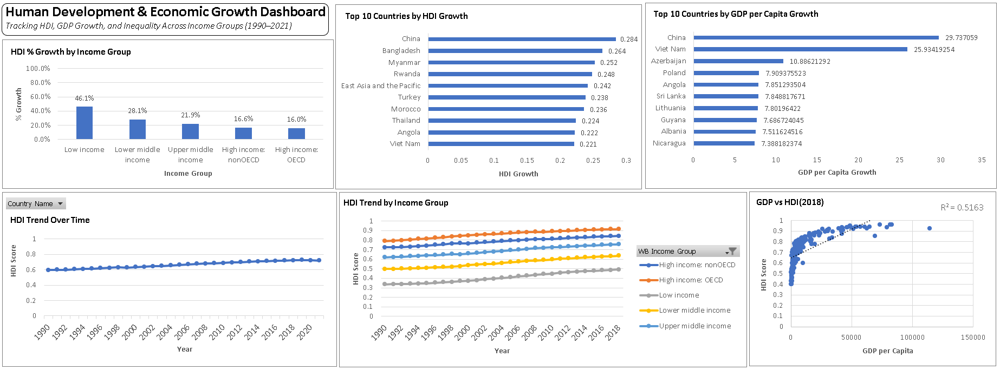
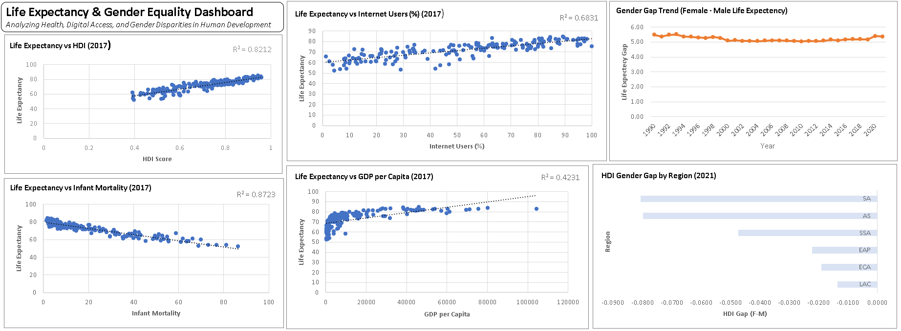
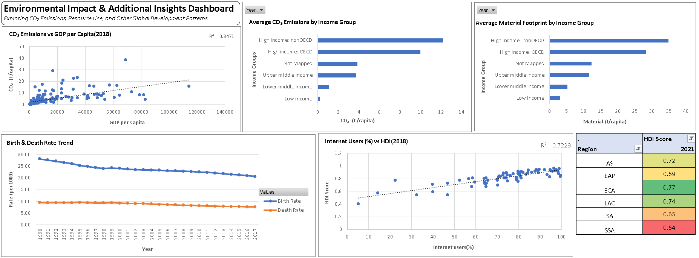

# 📊 Global Human Development & Economic Trends Analysis

*A data-driven Excel project exploring progress, inequality, and sustainability across countries using HDI and World Bank indicators.*

---

## 📘 Project Overview

This project explores global development patterns by analyzing and visualizing key indicators from the United Nations and the World Bank. The goal is to uncover insights related to human progress, inequality, life expectancy, gender gaps, and environmental sustainability across different countries and income groups.

---

## 🧠 Business Problem Statement

The United Nations and World Bank collect data on economic and social development across countries. As a data analyst, the goal is to combine and analyze this data to understand global development trends, identify inequalities, and offer recommendations to support inclusive and sustainable growth.

---

## ❓ Key Questions Answered

- Which countries saw the most growth in HDI and GDP?
- What factors most influence life expectancy?
- Are low-income countries catching up?
- Is there a gender gap in development?
- Do rich countries cause more environmental harm?

---
## 🗂️ Project Structure

```
📁 Global-Human-Development-Excel-Analysis/
├── README.md
├── LICENSE
│
├── data/
│   ├── HDI.csv
│   ├── WorldBank.xlsx
│   └── world_indicators_data_dictionary.csv
│
├── workbook/
│   └── Final_Human_Development_Analysis.xlsx   # All raw, cleaned, merged data & 3 dashboards + insights
│
├── documentation/
│   ├── Dashboard_Insights.pdf   # Dashboard-wise insights
│   └── Final_Summary_and_Recommendations.pdf   # Final project summary + recommendations
│
├── images/
│   ├── dashboard_1_preview.png
│   ├── dashboard_2_preview.png
│   └── dashboard_3_preview.png
```

---

## 🛠 Tools & Techniques

- **Microsoft Excel** – Primary tool for data cleaning, merging, and visualization  
- **Power Query** – Used for data transformation and merging  
- **Pivot Tables & Charts** – Used to derive insights  
- **Scatter Plots, Line Charts, Bar Charts** – For correlation and trend analysis  
- **Conditional Formatting** – For heatmap-based regional HDI visualizations  

---

## 🔍 Key Insights

- **Low-income countries** showed the highest % growth in HDI — strong signs of global development convergence.  
- **HDI** is the strongest predictor of life expectancy, stronger than GDP or internet access.  
- A **persistent gender gap** exists in HDI and life expectancy, though narrowing slowly.  
- **High-income countries** contribute the most to CO₂ emissions and material footprint.  
- **Digital access** is strongly correlated with human development.  
- **Birth and death rates** are both declining — indicating population aging and lower growth rates.  

---
## 📊 Dashboard Previews

### 🌍 Dashboard 1: Development Growth


### ❤️ Dashboard 2: Life Expectancy & Gender Gaps


### 🌱 Dashboard 3: Environmental & Demographic Impact


---

## ✅ Final Recommendations

📌 **Support Fast-Progressing Countries**  
Study successful development models from countries like China, Viet Nam, and Rwanda to inform development planning in other low- and middle-income nations.

📌 **Invest in Human Development to Improve Health**  
Focus on HDI drivers like education, income, and healthcare to sustainably boost life expectancy.

📌 **Bridge the Gender Gap in Development**  
Implement gender-specific policies that promote access to education, employment, and healthcare for women and girls.

📌 **Promote Equitable and Sustainable Growth**  
Encourage economic expansion that reduces inequality and limits environmental harm, especially in high-income nations.

📌 **Prepare for Demographic Shifts**  
Develop policies for aging populations through pension reforms, health infrastructure, and workforce planning.

📌 **Close the Digital Divide**  
Expand internet access as a critical tool for development, especially in under-connected regions.

📌 **Target Regional Disparities**  
Prioritize Sub-Saharan Africa and South Asia in global aid and policy programs, while sustaining gains in developed regions.

> 📄 For complete visual analysis and dashboard-wise insights, see:  
> [`documentation/Dashboard_Insights.pdf`](./documentation/Dashboard_Insights.pdf)  
> [`documentation/Final_Summary_and_Recommendations.pdf`](./documentation/Final_Summary_and_Recommendations.pdf)

---

## 📚 Data Sources

- **Maven Analytics – Data Playground**  
  [https://www.mavenanalytics.io/data-playground](https://www.mavenanalytics.io/data-playground)  
  This project is based on publicly available HDI and World Bank data curated by Maven Analytics.

---

## 📄 License

This project is licensed under the [MIT License](./LICENSE). You are free to reuse, adapt, and share for learning or non-commercial purposes.

---

## 🙌 Acknowledgments

Thanks to **Maven Analytics** for curating accessible, high-quality development datasets to enable impactful learning and exploration.
